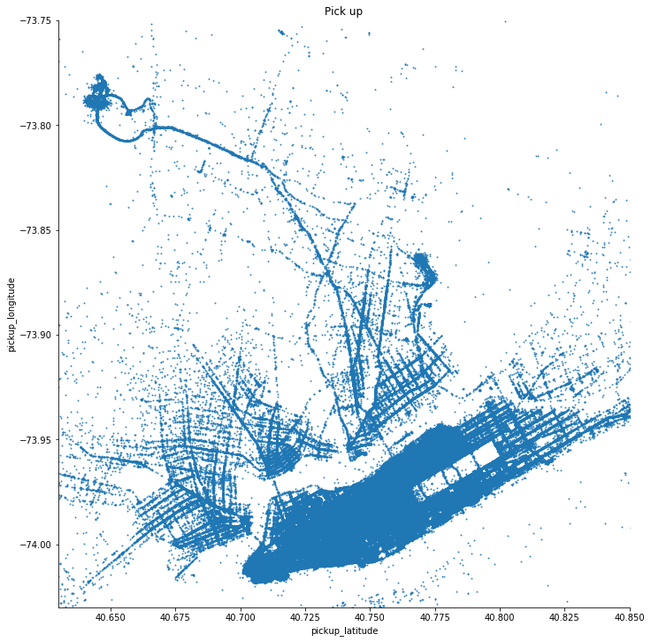
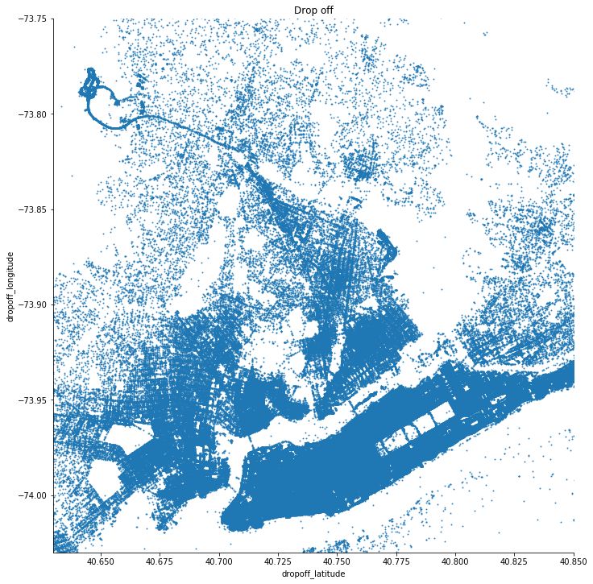
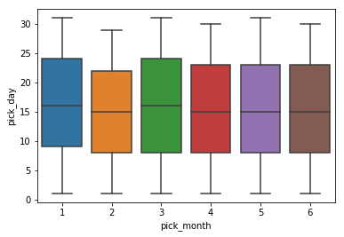
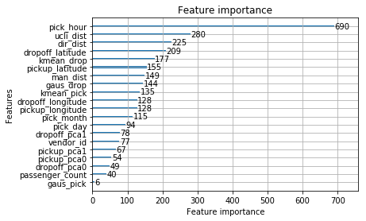
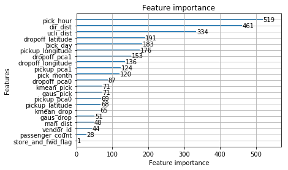

# Kaggle : New York City Taxi Trip Duration


# 1 EDA (Exploratory Data Analysis)

# purpose of  EDA

- Suggest hypotheses about the causes of observed phenomena
- Assess assumptions on which statistical inference will be based
- Support the selection of appropriate statistical tools and techniques
- Provide a basis for further data collection through surveys or experiments

# EDA methods
- Graphical techniques used in EDA are:
    - boxplot 
        - detailed feature (datetime by month, day of week, hours)
    - historgram or barplot (distribution) # bin = range of value
        - origin feature (pick lat,long, drop lat, long, duration, passenger count, flag)
        - detailed feature (datetime by month, day of week, hours)
    - scatter plot
        - duration vs distance = to check odd data
    - Parallel Coordinates vs Colormaps vs Andrews curves charts
    - odd ratio????

- Quantative methods:
    - Trimean == tukey method?

# 1.1 Understanding data 


```python
from IPython.display import display
import numpy as np
import matplotlib.pyplot as plt
import pandas as pd
from math import sin, cos, sqrt, atan2, radians
import seaborn as sns
import lightgbm as lgb
from sklearn.decomposition import PCA
from sklearn.cluster import DBSCAN
from sklearn.cluster import SpectralClustering
from sklearn.cluster import MeanShift
from sklearn.cluster import MiniBatchKMeans
from sklearn.model_selection import train_test_split


from sklearn import metrics
from sklearn.preprocessing import StandardScaler
from sklearn.preprocessing import Normalizer

%matplotlib inline

import warnings
warnings.filterwarnings("ignore")
```


```python
train = pd.read_csv("train.csv")
train.head()
```


<div>
<style scoped>
    .dataframe tbody tr th:only-of-type {
        vertical-align: middle;
    }

    .dataframe tbody tr th {
        vertical-align: top;
    }

    .dataframe thead th {
        text-align: right;
    }
</style>
<table border="1" class="dataframe">
  <thead>
    <tr style="text-align: right;">
      <th></th>
      <th>id</th>
      <th>vendor_id</th>
      <th>pickup_datetime</th>
      <th>dropoff_datetime</th>
      <th>passenger_count</th>
      <th>pickup_longitude</th>
      <th>pickup_latitude</th>
      <th>dropoff_longitude</th>
      <th>dropoff_latitude</th>
      <th>store_and_fwd_flag</th>
      <th>trip_duration</th>
    </tr>
  </thead>
  <tbody>
    <tr>
      <th>0</th>
      <td>id2875421</td>
      <td>2</td>
      <td>2016-03-14 17:24:55</td>
      <td>2016-03-14 17:32:30</td>
      <td>1</td>
      <td>-73.982155</td>
      <td>40.767937</td>
      <td>-73.964630</td>
      <td>40.765602</td>
      <td>N</td>
      <td>455</td>
    </tr>
    <tr>
      <th>1</th>
      <td>id2377394</td>
      <td>1</td>
      <td>2016-06-12 00:43:35</td>
      <td>2016-06-12 00:54:38</td>
      <td>1</td>
      <td>-73.980415</td>
      <td>40.738564</td>
      <td>-73.999481</td>
      <td>40.731152</td>
      <td>N</td>
      <td>663</td>
    </tr>
    <tr>
      <th>2</th>
      <td>id3858529</td>
      <td>2</td>
      <td>2016-01-19 11:35:24</td>
      <td>2016-01-19 12:10:48</td>
      <td>1</td>
      <td>-73.979027</td>
      <td>40.763939</td>
      <td>-74.005333</td>
      <td>40.710087</td>
      <td>N</td>
      <td>2124</td>
    </tr>
    <tr>
      <th>3</th>
      <td>id3504673</td>
      <td>2</td>
      <td>2016-04-06 19:32:31</td>
      <td>2016-04-06 19:39:40</td>
      <td>1</td>
      <td>-74.010040</td>
      <td>40.719971</td>
      <td>-74.012268</td>
      <td>40.706718</td>
      <td>N</td>
      <td>429</td>
    </tr>
    <tr>
      <th>4</th>
      <td>id2181028</td>
      <td>2</td>
      <td>2016-03-26 13:30:55</td>
      <td>2016-03-26 13:38:10</td>
      <td>1</td>
      <td>-73.973053</td>
      <td>40.793209</td>
      <td>-73.972923</td>
      <td>40.782520</td>
      <td>N</td>
      <td>435</td>
    </tr>
  </tbody>
</table>
</div>


```python
test = pd.read_csv("test.csv")
test.head()
```


<div>
<style scoped>
    .dataframe tbody tr th:only-of-type {
        vertical-align: middle;
    }

    .dataframe tbody tr th {
        vertical-align: top;
    }

    .dataframe thead th {
        text-align: right;
    }
</style>
<table border="1" class="dataframe">
  <thead>
    <tr style="text-align: right;">
      <th></th>
      <th>id</th>
      <th>vendor_id</th>
      <th>pickup_datetime</th>
      <th>passenger_count</th>
      <th>pickup_longitude</th>
      <th>pickup_latitude</th>
      <th>dropoff_longitude</th>
      <th>dropoff_latitude</th>
      <th>store_and_fwd_flag</th>
    </tr>
  </thead>
  <tbody>
    <tr>
      <th>0</th>
      <td>id3004672</td>
      <td>1</td>
      <td>2016-06-30 23:59:58</td>
      <td>1</td>
      <td>-73.988129</td>
      <td>40.732029</td>
      <td>-73.990173</td>
      <td>40.756680</td>
      <td>N</td>
    </tr>
    <tr>
      <th>1</th>
      <td>id3505355</td>
      <td>1</td>
      <td>2016-06-30 23:59:53</td>
      <td>1</td>
      <td>-73.964203</td>
      <td>40.679993</td>
      <td>-73.959808</td>
      <td>40.655403</td>
      <td>N</td>
    </tr>
    <tr>
      <th>2</th>
      <td>id1217141</td>
      <td>1</td>
      <td>2016-06-30 23:59:47</td>
      <td>1</td>
      <td>-73.997437</td>
      <td>40.737583</td>
      <td>-73.986160</td>
      <td>40.729523</td>
      <td>N</td>
    </tr>
    <tr>
      <th>3</th>
      <td>id2150126</td>
      <td>2</td>
      <td>2016-06-30 23:59:41</td>
      <td>1</td>
      <td>-73.956070</td>
      <td>40.771900</td>
      <td>-73.986427</td>
      <td>40.730469</td>
      <td>N</td>
    </tr>
    <tr>
      <th>4</th>
      <td>id1598245</td>
      <td>1</td>
      <td>2016-06-30 23:59:33</td>
      <td>1</td>
      <td>-73.970215</td>
      <td>40.761475</td>
      <td>-73.961510</td>
      <td>40.755890</td>
      <td>N</td>
    </tr>
  </tbody>
</table>
</div>


```python
sample_submission = pd.read_csv("sample_submission.csv")
sample_submission.head()
```


<div>
<style scoped>
    .dataframe tbody tr th:only-of-type {
        vertical-align: middle;
    }

    .dataframe tbody tr th {
        vertical-align: top;
    }

    .dataframe thead th {
        text-align: right;
    }
</style>
<table border="1" class="dataframe">
  <thead>
    <tr style="text-align: right;">
      <th></th>
      <th>id</th>
      <th>trip_duration</th>
    </tr>
  </thead>
  <tbody>
    <tr>
      <th>0</th>
      <td>id3004672</td>
      <td>959</td>
    </tr>
    <tr>
      <th>1</th>
      <td>id3505355</td>
      <td>959</td>
    </tr>
    <tr>
      <th>2</th>
      <td>id1217141</td>
      <td>959</td>
    </tr>
    <tr>
      <th>3</th>
      <td>id2150126</td>
      <td>959</td>
    </tr>
    <tr>
      <th>4</th>
      <td>id1598245</td>
      <td>959</td>
    </tr>
  </tbody>
</table>
</div>


# 1.1.a Data type and unit

# unit

### 1. latitude / longtitude = decimal degree 
- 111.32mm per 0.000001° / 11.132 m per 0.0001° / 1.1132 km per 0.01° / 111.32 km per 1.0°
- 14 demical degree
- ex) 40.767937 , -73.982155

### 2. datetime = year-month-day: hour-minute-second

### 3. vendor_id = 1, 2

### 4. passenger_count = 0,,,,9

### 4. store_and_fwd_flag = N, Y

### 6. duration = second
- ex) 455 sec = 7min 35sec


```python
train.info()
```

    <class 'pandas.core.frame.DataFrame'>
    RangeIndex: 1458644 entries, 0 to 1458643
    Data columns (total 11 columns):
    id                    1458644 non-null object
    vendor_id             1458644 non-null int64
    pickup_datetime       1458644 non-null object
    dropoff_datetime      1458644 non-null object
    passenger_count       1458644 non-null int64
    pickup_longitude      1458644 non-null float64
    pickup_latitude       1458644 non-null float64
    dropoff_longitude     1458644 non-null float64
    dropoff_latitude      1458644 non-null float64
    store_and_fwd_flag    1458644 non-null object
    trip_duration         1458644 non-null int64
    dtypes: float64(4), int64(3), object(4)
    memory usage: 122.4+ MB


```python
test.info()
```

    <class 'pandas.core.frame.DataFrame'>
    RangeIndex: 625134 entries, 0 to 625133
    Data columns (total 9 columns):
    id                    625134 non-null object
    vendor_id             625134 non-null int64
    pickup_datetime       625134 non-null object
    passenger_count       625134 non-null int64
    pickup_longitude      625134 non-null float64
    pickup_latitude       625134 non-null float64
    dropoff_longitude     625134 non-null float64
    dropoff_latitude      625134 non-null float64
    store_and_fwd_flag    625134 non-null object
    dtypes: float64(4), int64(2), object(3)
    memory usage: 42.9+ MB


```python
sample_submission.info()
```

    <class 'pandas.core.frame.DataFrame'>
    RangeIndex: 625134 entries, 0 to 625133
    Data columns (total 2 columns):
    id               625134 non-null object
    trip_duration    625134 non-null int64
    dtypes: int64(1), object(1)
    memory usage: 9.5+ MB


# train data
-  1.4M data, 11 columns

# test data
-  0.6M data, 9 columns (no dropoff_datetime, trip_duration)

# sample_submission
-  0.6M data, 2 columns (id, trip_duration)

# 1.1.b Missing Data check


```python
#none of missing data
train.isnull().sum()
```


    id                    0
    vendor_id             0
    pickup_datetime       0
    dropoff_datetime      0
    passenger_count       0
    pickup_longitude      0
    pickup_latitude       0
    dropoff_longitude     0
    dropoff_latitude      0
    store_and_fwd_flag    0
    trip_duration         0
    dtype: int64


```python
test.isnull().sum()
```


    id                    0
    vendor_id             0
    pickup_datetime       0
    passenger_count       0
    pickup_longitude      0
    pickup_latitude       0
    dropoff_longitude     0
    dropoff_latitude      0
    store_and_fwd_flag    0
    dtype: int64


# 1.1.c Trip duration check


```python
train["pickup_datetime"] =  pd.to_datetime(train["pickup_datetime"])
train["dropoff_datetime"] =  pd.to_datetime(train["dropoff_datetime"])
sample_duration = train["dropoff_datetime"] - train["pickup_datetime"]
sample_duration_sec = sample_duration.dt.total_seconds().astype('int')
train['trip_sec'] =  sample_duration_sec
```


```python
train_d = train[train["trip_duration"] != train["trip_sec"]]
print(len(train_d))

if len(train_d) == 0:
    train = train.drop(['trip_sec'], axis=1)
```

    0


### NYC Taxi Trip Duration [Train data]는

### 총 1,458,644 Row와 11 Column으로 구성되어 있으며,

### Missing Data는 존재하지 않습니다.

# 1.1.c Column information

- id : 개별 Taxi에 부여된 고유 id (이건 그냥 쓴거예요...)
- verdor_id : Taxi Company id >>>  1, 2로 구성되어 있는걸로 봐서 2개의 회사를 대상
- pickup/dropoff datetime : 출발/도착 시간정보 >> 년, 월, 일, 시각 정보가 포함
- passenger_count : 승객수 >>> 0~9명까지 존재
- pickup/dropoff_longitude & latitude : 출발/도착 지리정보
- store_and_fwd_flag : whether the trip data was sent immediately to the vendor (“N”) or held in the memory of the taxi because there was no connection to the server (“Y”)
- trip_duration : 탑승시간 >>> 단위는 Seconds

# 1.2 Feature Engineering & Data Cleaning

### 1.2.a Add columns with detailed informations


- duration per min
- datetime per hour
- datetime per day of week
- datetime per month

# date time convert


```python
train = train.drop("dropoff_datetime", axis=1)
```


```python
#data type convert to datetime from object
train["pickup_datetime"] =  pd.to_datetime(train["pickup_datetime"])
test["pickup_datetime"] =  pd.to_datetime(test["pickup_datetime"])
```


```python
#day of week
#Monday=0, Sunday=6
train["pick_month"] = train["pickup_datetime"].apply(lambda x : x.month)
train["pick_day"] = train["pickup_datetime"].apply(lambda x : x.day)
train["pick_hour"] = train["pickup_datetime"].apply(lambda x : x.hour)
# train["pick_min"] = train["pickup_datetime"].apply(lambda x : x.minute)
# train["pick_sec"] = train["pickup_datetime"].apply(lambda x : x.second)

#day of week
#Monday=0, Sunday=6
test["pick_month"] = test["pickup_datetime"].apply(lambda x : x.month)
test["pick_day"] = test["pickup_datetime"].apply(lambda x : x.day)
test["pick_hour"] = test["pickup_datetime"].apply(lambda x : x.hour)
# test["pick_min"] = test["pickup_datetime"].apply(lambda x : x.minute)
# test["pick_sec"] = test["pickup_datetime"].apply(lambda x : x.second)
```


```python
# train = train.drop('pickup_datetime', axis=1)
# test = test.drop('pickup_datetime', axis=1)
```


```python
train.head()
```


<div>
<style scoped>
    .dataframe tbody tr th:only-of-type {
        vertical-align: middle;
    }

    .dataframe tbody tr th {
        vertical-align: top;
    }

    .dataframe thead th {
        text-align: right;
    }
</style>
<table border="1" class="dataframe">
  <thead>
    <tr style="text-align: right;">
      <th></th>
      <th>id</th>
      <th>vendor_id</th>
      <th>pickup_datetime</th>
      <th>passenger_count</th>
      <th>pickup_longitude</th>
      <th>pickup_latitude</th>
      <th>dropoff_longitude</th>
      <th>dropoff_latitude</th>
      <th>store_and_fwd_flag</th>
      <th>trip_duration</th>
      <th>pick_month</th>
      <th>pick_day</th>
      <th>pick_hour</th>
    </tr>
  </thead>
  <tbody>
    <tr>
      <th>0</th>
      <td>id2875421</td>
      <td>2</td>
      <td>2016-03-14 17:24:55</td>
      <td>1</td>
      <td>-73.982155</td>
      <td>40.767937</td>
      <td>-73.964630</td>
      <td>40.765602</td>
      <td>N</td>
      <td>455</td>
      <td>3</td>
      <td>14</td>
      <td>17</td>
    </tr>
    <tr>
      <th>1</th>
      <td>id2377394</td>
      <td>1</td>
      <td>2016-06-12 00:43:35</td>
      <td>1</td>
      <td>-73.980415</td>
      <td>40.738564</td>
      <td>-73.999481</td>
      <td>40.731152</td>
      <td>N</td>
      <td>663</td>
      <td>6</td>
      <td>12</td>
      <td>0</td>
    </tr>
    <tr>
      <th>2</th>
      <td>id3858529</td>
      <td>2</td>
      <td>2016-01-19 11:35:24</td>
      <td>1</td>
      <td>-73.979027</td>
      <td>40.763939</td>
      <td>-74.005333</td>
      <td>40.710087</td>
      <td>N</td>
      <td>2124</td>
      <td>1</td>
      <td>19</td>
      <td>11</td>
    </tr>
    <tr>
      <th>3</th>
      <td>id3504673</td>
      <td>2</td>
      <td>2016-04-06 19:32:31</td>
      <td>1</td>
      <td>-74.010040</td>
      <td>40.719971</td>
      <td>-74.012268</td>
      <td>40.706718</td>
      <td>N</td>
      <td>429</td>
      <td>4</td>
      <td>6</td>
      <td>19</td>
    </tr>
    <tr>
      <th>4</th>
      <td>id2181028</td>
      <td>2</td>
      <td>2016-03-26 13:30:55</td>
      <td>1</td>
      <td>-73.973053</td>
      <td>40.793209</td>
      <td>-73.972923</td>
      <td>40.782520</td>
      <td>N</td>
      <td>435</td>
      <td>3</td>
      <td>26</td>
      <td>13</td>
    </tr>
  </tbody>
</table>
</div>


# holiday crawling


```python
from bs4 import BeautifulSoup
import requests 
import urllib.request
```


```python
#wrapper > div:nth-child(3) > div.twelve.columns > table.list-table > tbody > tr:nth-child(2) > td:nth-child(2)
```


```python
df = pd.DataFrame(columns=["rank","keyword"])
response = requests.get("https://www.officeholidays.com/countries/usa/2016.php")
bs = BeautifulSoup(response.content, "html.parser")
trs = bs.select("table td")
trs1 = trs[1::5]
```


```python
li = []
holi = pd.DataFrame()
count = 0

for i in trs1[0:14]:
    li.append((i.text).strip())
    li[count] = '2016 ' + li[count]
    li[count] = li[count].split(" ")
    li[count] = li[count][0] + "-" + li[count][1] + '-' + li[count][2]
    count += 1 

holi['date'] = li 
holi['date'] = pd.to_datetime(holi['date'])
holi
```


<div>
<style scoped>
    .dataframe tbody tr th:only-of-type {
        vertical-align: middle;
    }

    .dataframe tbody tr th {
        vertical-align: top;
    }

    .dataframe thead th {
        text-align: right;
    }
</style>
<table border="1" class="dataframe">
  <thead>
    <tr style="text-align: right;">
      <th></th>
      <th>date</th>
    </tr>
  </thead>
  <tbody>
    <tr>
      <th>0</th>
      <td>2016-01-01</td>
    </tr>
    <tr>
      <th>1</th>
      <td>2016-01-18</td>
    </tr>
    <tr>
      <th>2</th>
      <td>2016-02-15</td>
    </tr>
    <tr>
      <th>3</th>
      <td>2016-04-15</td>
    </tr>
    <tr>
      <th>4</th>
      <td>2016-05-08</td>
    </tr>
    <tr>
      <th>5</th>
      <td>2016-05-30</td>
    </tr>
    <tr>
      <th>6</th>
      <td>2016-06-19</td>
    </tr>
    <tr>
      <th>7</th>
      <td>2016-07-04</td>
    </tr>
    <tr>
      <th>8</th>
      <td>2016-09-05</td>
    </tr>
    <tr>
      <th>9</th>
      <td>2016-10-10</td>
    </tr>
    <tr>
      <th>10</th>
      <td>2016-11-11</td>
    </tr>
    <tr>
      <th>11</th>
      <td>2016-11-24</td>
    </tr>
    <tr>
      <th>12</th>
      <td>2016-11-25</td>
    </tr>
    <tr>
      <th>13</th>
      <td>2016-12-26</td>
    </tr>
  </tbody>
</table>
</div>


```python
holi.date
```


    0    2016-01-01
    1    2016-01-18
    2    2016-02-15
    3    2016-04-15
    4    2016-05-08
    5    2016-05-30
    6    2016-06-19
    7    2016-07-04
    8    2016-09-05
    9    2016-10-10
    10   2016-11-11
    11   2016-11-24
    12   2016-11-25
    13   2016-12-26
    Name: date, dtype: datetime64[ns]


```python
(train.pickup_datetime.apply(lambda x : x.date())).isin(holi.date).sum()
```


    0


```python
a = pd.Series(pd.datetime(2016,1,1))
```


```python
a
```


    0   2016-01-01
    dtype: datetime64[ns]


```python
a.isin(holi.date)
```


    0    False
    dtype: bool


```python
train.pickup_datetime[1] not in holi.date
```


    True


```python
if holi.date[1] is train.pickup_datetime:
    print('1')
```


      File "<ipython-input-466-524da8f4ba74>", line 1
        if holi.date[1] is in train.pickup_datetime:
                            ^
    SyntaxError: invalid syntax


```python
a = [23, 11, 21, 34, 53, 89, 133, 211, 345, 535, 895]

b = [11, 32, 33, 45, 25, 66, 87, 863, 97, 130, 141, 126, 13]

x=[]
for i in a:
    for j in b:
        if i==j and j not in x:
            x.append(j)

print(x)

```

    [11]


```python
for i in holi.date:
    if i is in train.pickup_datetime:
        train['holiday'] = 1
    else:
        train['holiday'] = 0
```


    ---------------------------------------------------------------------------

    ValueError                                Traceback (most recent call last)

    <ipython-input-458-fdb3a3408a04> in <module>()
          1 for i in range(5):
    ----> 2     if holi.date == train.pickup_datetime[i]:
          3         train['holiday'] = 1
          4     else:
          5         train['holiday'] = 0


    ~/anaconda3/lib/python3.6/site-packages/pandas/core/generic.py in __nonzero__(self)
       1119         raise ValueError("The truth value of a {0} is ambiguous. "
       1120                          "Use a.empty, a.bool(), a.item(), a.any() or a.all()."
    -> 1121                          .format(self.__class__.__name__))
       1122 
       1123     __bool__ = __nonzero__


    ValueError: The truth value of a Series is ambiguous. Use a.empty, a.bool(), a.item(), a.any() or a.all().


```python
for i in range(len(train)):
    if train.pickup_datetime[i] == holi.date:
        train['holiday'] = 1
```


```python
train['holiday'] = 1 * (train.pickup_datetime == holi.date)
test['holiday'] = 1 * (test.pickup_datetime == holi.date)
```


    ---------------------------------------------------------------------------

    ValueError                                Traceback (most recent call last)

    <ipython-input-453-cbd605410066> in <module>()
    ----> 1 train['holiday'] = 1 * (train.pickup_datetime == holi.date)
          2 test['holiday'] = 1 * (test.pickup_datetime == holi.date)


    ~/anaconda3/lib/python3.6/site-packages/pandas/core/ops.py in wrapper(self, other, axis)
        834             if not self._indexed_same(other):
        835                 msg = 'Can only compare identically-labeled Series objects'
    --> 836                 raise ValueError(msg)
        837             return self._constructor(na_op(self.values, other.values),
        838                                      index=self.index, name=name)


    ValueError: Can only compare identically-labeled Series objects


# New York City Weather Event 


```python
from selenium import webdriver
```


```python
driver =  webdriver.PhantomJS()    
driver.get("https://www.weather.gov/okx/stormevents")
```


```python
date = driver.find_elements_by_css_selector('#pagebody > div:nth-child(3) > div > table > tbody > tr > td ul:nth-child(6)')
lis = date[0].find_elements_by_css_selector('li')
```


```python
li_wea = []
count = 0

rows=[]
for i in lis:
    li_wea.append(i.text)
    li_wea[count] = '2016 ' + li_wea[count]
    li_wea[count] = li_wea[count].split(" ")

    li_wea[count] = li_wea[count][0] + "-" + li_wea[count][1] + "-" + li_wea[count][2] + "-" + li_wea[count][3]
#     rows.append([li_wea[count][0], li_wea[count][1], li_wea[count][2] ,li_wea[count][3]])
    count += 1 

    
#rows
```


```python
new1 = pd.DataFrame(li_wea, columns=['old'])
new1['date'] = new1['old'].str.extract('(\d\d\d\d-...-\d\d)', expand=True)
```


```python
new1['date'][4] = '2016-Feb-05'
new1['date'][5] = '2016-Feb-08'
new1['date'][11] = '2016-Apr-03'
new1['date'][12] = '2016-Apr-04'
new1['date'][14] = '2016-June-28'
new1['date'][15] = '2016-July-18'
new1['date'][16] = '2016-July-29'
new1['date'][17] = '2016-July-31'
new1['date'][25] = '2016-Oct-08'
new1['date'][35] = '2016-Dec-05'
new1 = new1.drop('old', axis=1)
```


```python
new2 = pd.DataFrame(['2016-August-01', '2016-Dec-01'], columns=['date'])
new1 = new1.append(new2, ignore_index=True).dropna()
```


```python
new1['date'] = pd.to_datetime(new1['date'])
new1
```


<div>
<style scoped>
    .dataframe tbody tr th:only-of-type {
        vertical-align: middle;
    }

    .dataframe tbody tr th {
        vertical-align: top;
    }

    .dataframe thead th {
        text-align: right;
    }
</style>
<table border="1" class="dataframe">
  <thead>
    <tr style="text-align: right;">
      <th></th>
      <th>date</th>
    </tr>
  </thead>
  <tbody>
    <tr>
      <th>0</th>
      <td>2016-01-10</td>
    </tr>
    <tr>
      <th>1</th>
      <td>2016-01-13</td>
    </tr>
    <tr>
      <th>2</th>
      <td>2016-01-17</td>
    </tr>
    <tr>
      <th>3</th>
      <td>2016-01-23</td>
    </tr>
    <tr>
      <th>4</th>
      <td>2016-02-05</td>
    </tr>
    <tr>
      <th>5</th>
      <td>2016-02-08</td>
    </tr>
    <tr>
      <th>6</th>
      <td>2016-02-15</td>
    </tr>
    <tr>
      <th>7</th>
      <td>2016-02-24</td>
    </tr>
    <tr>
      <th>8</th>
      <td>2016-03-14</td>
    </tr>
    <tr>
      <th>9</th>
      <td>2016-03-21</td>
    </tr>
    <tr>
      <th>10</th>
      <td>2016-03-28</td>
    </tr>
    <tr>
      <th>11</th>
      <td>2016-04-03</td>
    </tr>
    <tr>
      <th>12</th>
      <td>2016-04-04</td>
    </tr>
    <tr>
      <th>13</th>
      <td>2016-05-30</td>
    </tr>
    <tr>
      <th>14</th>
      <td>2016-06-28</td>
    </tr>
    <tr>
      <th>15</th>
      <td>2016-07-18</td>
    </tr>
    <tr>
      <th>16</th>
      <td>2016-07-29</td>
    </tr>
    <tr>
      <th>17</th>
      <td>2016-07-31</td>
    </tr>
    <tr>
      <th>18</th>
      <td>2016-08-10</td>
    </tr>
    <tr>
      <th>19</th>
      <td>2016-08-11</td>
    </tr>
    <tr>
      <th>20</th>
      <td>2016-08-12</td>
    </tr>
    <tr>
      <th>21</th>
      <td>2016-08-13</td>
    </tr>
    <tr>
      <th>22</th>
      <td>2016-08-20</td>
    </tr>
    <tr>
      <th>24</th>
      <td>2016-09-19</td>
    </tr>
    <tr>
      <th>25</th>
      <td>2016-10-08</td>
    </tr>
    <tr>
      <th>26</th>
      <td>2016-10-22</td>
    </tr>
    <tr>
      <th>27</th>
      <td>2016-10-22</td>
    </tr>
    <tr>
      <th>28</th>
      <td>2016-10-27</td>
    </tr>
    <tr>
      <th>29</th>
      <td>2016-10-30</td>
    </tr>
    <tr>
      <th>30</th>
      <td>2016-11-11</td>
    </tr>
    <tr>
      <th>31</th>
      <td>2016-11-14</td>
    </tr>
    <tr>
      <th>32</th>
      <td>2016-11-20</td>
    </tr>
    <tr>
      <th>33</th>
      <td>2016-11-29</td>
    </tr>
    <tr>
      <th>34</th>
      <td>2016-11-30</td>
    </tr>
    <tr>
      <th>35</th>
      <td>2016-12-05</td>
    </tr>
    <tr>
      <th>36</th>
      <td>2016-12-15</td>
    </tr>
    <tr>
      <th>37</th>
      <td>2016-12-17</td>
    </tr>
    <tr>
      <th>38</th>
      <td>2016-12-18</td>
    </tr>
    <tr>
      <th>39</th>
      <td>2016-08-01</td>
    </tr>
    <tr>
      <th>40</th>
      <td>2016-12-01</td>
    </tr>
  </tbody>
</table>
</div>


```python
(train.pickup_datetime.apply(lambda x : x.date()) == new1.date.sort_index(inplace=True)).sum()
```


    0


```python
train['weather'] = 1 * (train.pickup_datetime == new1.date())
test['weather'] = 1 * (test.pickup_datetime == new1.date())
```

# 1.2.b Distance between pickup and dropoff location

# Geographic space
   - Manhattan distance vs Euclidean distance

### Euclidean distance
- unit = km

# uclidean Distance


```python
def ucli_dist(lat1, lon1, lat2, lon2):
    
    dist = []
    R = 6371.0
    
    for i in range(len(lat1)):
        lat11 = radians(lat1[i])
        lon11 = radians(lon1[i])
        lat22 = radians(lat2[i])
        lon22 = radians(lon2[i])
    
        dlon = lon22 - lon11
        dlat = lat22 - lat11
        
        a = sin(dlat / 2)**2 + cos(lat11) * cos(lat22) * sin(dlon / 2)**2
        c = 2 * atan2(sqrt(a), sqrt(1 - a))

        distance = R * c
        dist.append(distance)
        
    return dist
```


```python
train['ucli_dist'] = ucli_dist(train.pickup_latitude, train.pickup_longitude, train.dropoff_latitude, train.dropoff_longitude)
test['ucli_dist'] = ucli_dist(test.pickup_latitude, test.pickup_longitude, test.dropoff_latitude, test.dropoff_longitude)
```

# manhatan distance


```python
train['man_dist'] = (abs(train.dropoff_longitude - train.pickup_longitude) + abs(train.dropoff_latitude - train.pickup_latitude)) * 113.2
test['man_dist'] = (abs(test.dropoff_longitude - test.pickup_longitude) + abs(test.dropoff_latitude - test.pickup_latitude)) * 113.2
```


```python
train.head()
```


<div>
<style scoped>
    .dataframe tbody tr th:only-of-type {
        vertical-align: middle;
    }

    .dataframe tbody tr th {
        vertical-align: top;
    }

    .dataframe thead th {
        text-align: right;
    }
</style>
<table border="1" class="dataframe">
  <thead>
    <tr style="text-align: right;">
      <th></th>
      <th>id</th>
      <th>vendor_id</th>
      <th>pickup_datetime</th>
      <th>passenger_count</th>
      <th>pickup_longitude</th>
      <th>pickup_latitude</th>
      <th>dropoff_longitude</th>
      <th>dropoff_latitude</th>
      <th>store_and_fwd_flag</th>
      <th>trip_duration</th>
      <th>pick_month</th>
      <th>pick_day</th>
      <th>pick_hour</th>
      <th>ucli_dist</th>
      <th>man_dist</th>
    </tr>
  </thead>
  <tbody>
    <tr>
      <th>0</th>
      <td>id2875421</td>
      <td>2</td>
      <td>2016-03-14 17:24:55</td>
      <td>1</td>
      <td>-73.982155</td>
      <td>40.767937</td>
      <td>-73.964630</td>
      <td>40.765602</td>
      <td>N</td>
      <td>455</td>
      <td>3</td>
      <td>14</td>
      <td>17</td>
      <td>1.498521</td>
      <td>2.248074</td>
    </tr>
    <tr>
      <th>1</th>
      <td>id2377394</td>
      <td>1</td>
      <td>2016-06-12 00:43:35</td>
      <td>1</td>
      <td>-73.980415</td>
      <td>40.738564</td>
      <td>-73.999481</td>
      <td>40.731152</td>
      <td>N</td>
      <td>663</td>
      <td>6</td>
      <td>12</td>
      <td>0</td>
      <td>1.805507</td>
      <td>2.997289</td>
    </tr>
    <tr>
      <th>2</th>
      <td>id3858529</td>
      <td>2</td>
      <td>2016-01-19 11:35:24</td>
      <td>1</td>
      <td>-73.979027</td>
      <td>40.763939</td>
      <td>-74.005333</td>
      <td>40.710087</td>
      <td>N</td>
      <td>2124</td>
      <td>1</td>
      <td>19</td>
      <td>11</td>
      <td>6.385098</td>
      <td>9.073912</td>
    </tr>
    <tr>
      <th>3</th>
      <td>id3504673</td>
      <td>2</td>
      <td>2016-04-06 19:32:31</td>
      <td>1</td>
      <td>-74.010040</td>
      <td>40.719971</td>
      <td>-74.012268</td>
      <td>40.706718</td>
      <td>N</td>
      <td>429</td>
      <td>4</td>
      <td>6</td>
      <td>19</td>
      <td>1.485498</td>
      <td>1.752341</td>
    </tr>
    <tr>
      <th>4</th>
      <td>id2181028</td>
      <td>2</td>
      <td>2016-03-26 13:30:55</td>
      <td>1</td>
      <td>-73.973053</td>
      <td>40.793209</td>
      <td>-73.972923</td>
      <td>40.782520</td>
      <td>N</td>
      <td>435</td>
      <td>3</td>
      <td>26</td>
      <td>13</td>
      <td>1.188588</td>
      <td>1.224652</td>
    </tr>
  </tbody>
</table>
</div>


## direction


```python
def dir_dist(pickup_lat, pickup_long, dropoff_lat, dropoff_long):

    pickup_lat_rads = np.radians(pickup_lat)
    pickup_long_rads = np.radians(pickup_long)
    dropoff_lat_rads = np.radians(dropoff_lat)
    dropoff_long_rads = np.radians(dropoff_long)
    long_delta_rads = np.radians(dropoff_long_rads - pickup_long_rads)
    
    y = np.sin(long_delta_rads) * np.cos(dropoff_lat_rads)
    x = (np.cos(pickup_lat_rads) * np.sin(dropoff_lat_rads) - np.sin(pickup_lat_rads) * np.cos(dropoff_lat_rads) * np.cos(long_delta_rads))
    
    return np.degrees(np.arctan2(y, x))
```


```python
train['dir_dist'] = dir_dist(train.pickup_latitude, train.pickup_longitude, train.dropoff_latitude, train.dropoff_longitude)
test['dir_dist'] = dir_dist(test.pickup_latitude, test.pickup_longitude, test.dropoff_latitude, test.dropoff_longitude)
```

# 1.2.c Outlier Removal

### qualitative analysis
- 
- 
- 

### quantitative analysis
- Peirce's criterion
- Tukey's fences
- In anomaly detection
- Modified Thompson Tau test

# qualitative analysis


```python
# train.loc[train.ucli_distance > 200] = np.nan ##200km 넘는 데이터 제거
# train.loc[train.trip_duration > 36000] = np.nan ##40000초(약 11시간)가 넘는 데이터 제거
# train.loc[train.passenger_count == 0] = np.NAN   ### passenger 수가 0인 데이터 제거
# train.dropna(inplace=True)
```

# 1.2.d.2 Spatial Data Analysis

### Types of spatial analysis
- FA(factor analysis)
    - Euclidean metric = > PCA(principal component analysis)
    - Chi-Square distance => Correspondence Analysis (similar to PCA, but better for categrorical data)
    - Generalized Mahalanobis distance => Discriminant Analysis 

- Spatial autocorrelation

- Spatial stratified heterogeneity
    - geographical detector q-statistic

### Spatial dependency or auto-correlation

### Scaling

### Common errors in spatial analysis
- Length
- Locational fallacy
- Ecological fallacy
    - Modifiable areal unit problem
        - statistical bias

### stack-up coordinates data


```python
coord_pick_lat = pd.concat([train['pickup_latitude'], test['pickup_latitude']], axis=0)
coord_pick_lon = pd.concat([train['pickup_longitude'], test['pickup_longitude']], axis=0)
coord_drop_lat = pd.concat([train['dropoff_latitude'], test['dropoff_latitude']], axis=0)
coord_drop_lon = pd.concat([train['dropoff_longitude'], test['dropoff_longitude']], axis=0)

coord_pick = pd.concat([coord_pick_lat, coord_pick_lon], axis=1)
coord_drop = pd.concat([coord_drop_lat, coord_drop_lon], axis=1)

coord_lat = pd.concat([train['pickup_latitude'], train['dropoff_latitude'], test['pickup_latitude'], test['dropoff_latitude']], axis=0)
coord_lon = pd.concat([train['pickup_longitude'], train['dropoff_longitude'], test['pickup_longitude'], test['dropoff_longitude']], axis=0)
coord_all = pd.concat([coord_lat, coord_lon], axis=1)
coord_all.columns = ['lat', 'lon']
```

# coordinates scatter plot


```python
# new york city coordinate = (41.145495, −73.994901)
city_lon_border = (-74.03, -73.75)
city_lat_border = (40.63, 40.85)
```


```python
sns.lmplot(x='pickup_latitude', y='pickup_longitude', data=coord_pick, fit_reg=False, scatter_kws={"s": 1}, size=10)
plt.ylim(city_lon_border)
plt.xlim(city_lat_border)
plt.title('Pick up')
plt.show()
```





```python
sns.lmplot(x='dropoff_latitude', y='dropoff_longitude', data=coord_drop, fit_reg=False, scatter_kws={"s": 1}, size=10)
plt.ylim(city_lon_border)
plt.xlim(city_lat_border)
plt.title('Drop off')
plt.show()
```





# PCA


```python
pca = PCA(random_state=0).fit(coord_all)
```


```python
# train['pca_lat0'] = pca_lat.transform(train[['pickup_latitude']])[:, 0]
```


```python
#PCA
train['pickup_pca0'] = pca.transform(train[['pickup_latitude', 'pickup_longitude']])[:, 0]
train['pickup_pca1'] = pca.transform(train[['pickup_latitude', 'pickup_longitude']])[:, 1]
train['dropoff_pca0'] = pca.transform(train[['dropoff_latitude', 'dropoff_longitude']])[:, 0]
train['dropoff_pca1'] = pca.transform(train[['dropoff_latitude', 'dropoff_longitude']])[:, 1]
test['pickup_pca0'] = pca.transform(test[['pickup_latitude', 'pickup_longitude']])[:, 0]
test['pickup_pca1'] = pca.transform(test[['pickup_latitude', 'pickup_longitude']])[:, 1]
test['dropoff_pca0'] = pca.transform(test[['dropoff_latitude', 'dropoff_longitude']])[:, 0]
test['dropoff_pca1'] = pca.transform(test[['dropoff_latitude', 'dropoff_longitude']])[:, 1]
```


```python
train.head()
```


<div>
<style scoped>
    .dataframe tbody tr th:only-of-type {
        vertical-align: middle;
    }

    .dataframe tbody tr th {
        vertical-align: top;
    }

    .dataframe thead th {
        text-align: right;
    }
</style>
<table border="1" class="dataframe">
  <thead>
    <tr style="text-align: right;">
      <th></th>
      <th>id</th>
      <th>vendor_id</th>
      <th>pickup_datetime</th>
      <th>passenger_count</th>
      <th>pickup_longitude</th>
      <th>pickup_latitude</th>
      <th>dropoff_longitude</th>
      <th>dropoff_latitude</th>
      <th>store_and_fwd_flag</th>
      <th>trip_duration</th>
      <th>pick_month</th>
      <th>pick_day</th>
      <th>pick_hour</th>
      <th>ucli_dist</th>
      <th>man_dist</th>
      <th>dir_dist</th>
      <th>pickup_pca0</th>
      <th>pickup_pca1</th>
      <th>dropoff_pca0</th>
      <th>dropoff_pca1</th>
    </tr>
  </thead>
  <tbody>
    <tr>
      <th>0</th>
      <td>id2875421</td>
      <td>2</td>
      <td>2016-03-14 17:24:55</td>
      <td>1</td>
      <td>-73.982155</td>
      <td>40.767937</td>
      <td>-73.964630</td>
      <td>40.765602</td>
      <td>N</td>
      <td>455</td>
      <td>3</td>
      <td>14</td>
      <td>17</td>
      <td>1.498521</td>
      <td>2.248074</td>
      <td>174.333195</td>
      <td>0.007691</td>
      <td>0.017053</td>
      <td>-0.009666</td>
      <td>0.013695</td>
    </tr>
    <tr>
      <th>1</th>
      <td>id2377394</td>
      <td>1</td>
      <td>2016-06-12 00:43:35</td>
      <td>1</td>
      <td>-73.980415</td>
      <td>40.738564</td>
      <td>-73.999481</td>
      <td>40.731152</td>
      <td>N</td>
      <td>663</td>
      <td>6</td>
      <td>12</td>
      <td>0</td>
      <td>1.805507</td>
      <td>2.997289</td>
      <td>-178.051506</td>
      <td>0.007677</td>
      <td>-0.012371</td>
      <td>0.027145</td>
      <td>-0.018652</td>
    </tr>
    <tr>
      <th>2</th>
      <td>id3858529</td>
      <td>2</td>
      <td>2016-01-19 11:35:24</td>
      <td>1</td>
      <td>-73.979027</td>
      <td>40.763939</td>
      <td>-74.005333</td>
      <td>40.710087</td>
      <td>N</td>
      <td>2124</td>
      <td>1</td>
      <td>19</td>
      <td>11</td>
      <td>6.385098</td>
      <td>9.073912</td>
      <td>-179.629721</td>
      <td>0.004803</td>
      <td>0.012879</td>
      <td>0.034222</td>
      <td>-0.039337</td>
    </tr>
    <tr>
      <th>3</th>
      <td>id3504673</td>
      <td>2</td>
      <td>2016-04-06 19:32:31</td>
      <td>1</td>
      <td>-74.010040</td>
      <td>40.719971</td>
      <td>-74.012268</td>
      <td>40.706718</td>
      <td>N</td>
      <td>429</td>
      <td>4</td>
      <td>6</td>
      <td>19</td>
      <td>1.485498</td>
      <td>1.752341</td>
      <td>-179.872566</td>
      <td>0.038342</td>
      <td>-0.029194</td>
      <td>0.041343</td>
      <td>-0.042293</td>
    </tr>
    <tr>
      <th>4</th>
      <td>id2181028</td>
      <td>2</td>
      <td>2016-03-26 13:30:55</td>
      <td>1</td>
      <td>-73.973053</td>
      <td>40.793209</td>
      <td>-73.972923</td>
      <td>40.782520</td>
      <td>N</td>
      <td>435</td>
      <td>3</td>
      <td>26</td>
      <td>13</td>
      <td>1.188588</td>
      <td>1.224652</td>
      <td>179.990812</td>
      <td>-0.002877</td>
      <td>0.041749</td>
      <td>-0.002380</td>
      <td>0.031071</td>
    </tr>
  </tbody>
</table>
</div>


# 1.2.d.3 Coordinates Clustering
- K means
- DBSCAN
- SpectralClustering
- Meanshift

# Gaussian Mixture


```python
from sklearn.mixture import GaussianMixture
```


```python
gaus_pick = GaussianMixture(n_components=30).fit(coord_pick)
gaus_drop = GaussianMixture(n_components=30).fit(coord_drop)
```


    ---------------------------------------------------------------------------

    KeyboardInterrupt                         Traceback (most recent call last)

    <ipython-input-450-f31199f5dd7c> in <module>()
          1 gaus_pick = GaussianMixture(n_components=30).fit(coord_pick)
    ----> 2 gaus_drop = GaussianMixture(n_components=30).fit(coord_drop)
    

    ~/anaconda3/lib/python3.6/site-packages/sklearn/mixture/base.py in fit(self, X, y)
        211                 prev_lower_bound = self.lower_bound_
        212 
    --> 213                 log_prob_norm, log_resp = self._e_step(X)
        214                 self._m_step(X, log_resp)
        215                 self.lower_bound_ = self._compute_lower_bound(


    ~/anaconda3/lib/python3.6/site-packages/sklearn/mixture/base.py in _e_step(self, X)
        258             the point of each sample in X.
        259         """
    --> 260         log_prob_norm, log_resp = self._estimate_log_prob_resp(X)
        261         return np.mean(log_prob_norm), log_resp
        262 


    ~/anaconda3/lib/python3.6/site-packages/sklearn/mixture/base.py in _estimate_log_prob_resp(self, X)
        467             logarithm of the responsibilities
        468         """
    --> 469         weighted_log_prob = self._estimate_weighted_log_prob(X)
        470         log_prob_norm = logsumexp(weighted_log_prob, axis=1)
        471         with np.errstate(under='ignore'):


    ~/anaconda3/lib/python3.6/site-packages/sklearn/mixture/base.py in _estimate_weighted_log_prob(self, X)
        420         weighted_log_prob : array, shape (n_samples, n_component)
        421         """
    --> 422         return self._estimate_log_prob(X) + self._estimate_log_weights()
        423 
        424     @abstractmethod


    ~/anaconda3/lib/python3.6/site-packages/sklearn/mixture/gaussian_mixture.py in _estimate_log_prob(self, X)
        673     def _estimate_log_prob(self, X):
        674         return _estimate_log_gaussian_prob(
    --> 675             X, self.means_, self.precisions_cholesky_, self.covariance_type)
        676 
        677     def _estimate_log_weights(self):


    ~/anaconda3/lib/python3.6/site-packages/sklearn/mixture/gaussian_mixture.py in _estimate_log_gaussian_prob(X, means, precisions_chol, covariance_type)
        411         for k, (mu, prec_chol) in enumerate(zip(means, precisions_chol)):
        412             y = np.dot(X, prec_chol) - np.dot(mu, prec_chol)
    --> 413             log_prob[:, k] = np.sum(np.square(y), axis=1)
        414 
        415     elif covariance_type == 'tied':


    ~/anaconda3/lib/python3.6/site-packages/numpy/core/fromnumeric.py in sum(a, axis, dtype, out, keepdims)
       1880             return sum(axis=axis, dtype=dtype, out=out, **kwargs)
       1881     return _methods._sum(a, axis=axis, dtype=dtype,
    -> 1882                          out=out, **kwargs)
       1883 
       1884 


    ~/anaconda3/lib/python3.6/site-packages/numpy/core/_methods.py in _sum(a, axis, dtype, out, keepdims)
         30 
         31 def _sum(a, axis=None, dtype=None, out=None, keepdims=False):
    ---> 32     return umr_sum(a, axis, dtype, out, keepdims)
         33 
         34 def _prod(a, axis=None, dtype=None, out=None, keepdims=False):


    KeyboardInterrupt: 


```python
train['gaus_pick'] = gaus_pick.predict(train[['pickup_latitude', 'pickup_longitude']])
test['gaus_pick'] = gaus_pick.predict(test[['pickup_latitude', 'pickup_longitude']])
train['gaus_drop'] = gaus_drop.predict(train[['dropoff_latitude', 'dropoff_longitude']])
test['gaus_drop'] = gaus_drop.predict(test[['dropoff_latitude', 'dropoff_longitude']])
```

# Gaussian mixture cross validation score (per-sample average log-likelihood)


```python
X_train1, X_test1 = train_test_split(coord_pick, test_size=0.25, random_state=0)
X_train2, X_test2 = train_test_split(coord_drop, test_size=0.25, random_state=0)
```


```python
score1 = GaussianMixture(n_components=5, random_state=0).fit(X_train1)
score2 = GaussianMixture(n_components=10, random_state=0).fit(X_train1)
score3 = GaussianMixture(n_components=20, random_state=0).fit(X_train1)
score4 = GaussianMixture(n_components=30, random_state=0).fit(X_train1)
score5 = GaussianMixture(n_components=40, random_state=0).fit(X_train1)
score6 = GaussianMixture(n_components=50, random_state=0).fit(X_train1)
```


```python
score1.score(X_train1, X_test1), score2.score(X_train1, X_test1),  score3.score(X_train1, X_test1), score4.score(X_train1, X_test1), score5.score(X_train1, X_test1), score6.score(X_train1, X_test1)
```


    (5.131486226147653,
     5.329233407224287,
     5.460516405025573,
     5.493898199676078,
     5.510537865860641,
     5.5237474187352475)


# K means


```python
# kmean_pick = MiniBatchKMeans(n_clusters=30, random_state=0).fit(coord_pick)
# kmean_drop = MiniBatchKMeans(n_clusters=30, random_state=0).fit(coord_drop)
```


```python
# train['kmean_pick'] = kmean_pick.predict(train[['pickup_latitude', 'pickup_longitude']])
# test['kmean_pick'] = kmean_pick.predict(test[['pickup_latitude', 'pickup_longitude']])
# train['kmean_drop'] = kmean_drop.predict(train[['dropoff_latitude', 'dropoff_longitude']])
# test['kmean_drop'] = kmean_drop.predict(test[['dropoff_latitude', 'dropoff_longitude']])
```


# K means cross validation score (inertia_) 


```python
# X_train1, X_test1 = train_test_split(coord_pick, test_size=0.25, random_state=0)
# X_train2, X_test2 = train_test_split(coord_drop, test_size=0.25, random_state=0)
```


```python
# score1 = MiniBatchKMeans(n_clusters=5, random_state=0).fit(X_train1)
# score2 = MiniBatchKMeans(n_clusters=10, random_state=0).fit(X_train1)
# score3 = MiniBatchKMeans(n_clusters=20, random_state=0).fit(X_train1)
# score4 = MiniBatchKMeans(n_clusters=30, random_state=0).fit(X_train1)
# score5 = MiniBatchKMeans(n_clusters=40, random_state=0).fit(X_train1)
# score6 = MiniBatchKMeans(n_clusters=50, random_state=0).fit(X_train1)
# score7 = MiniBatchKMeans(n_clusters=100, random_state=0).fit(X_train1)
# score8 = MiniBatchKMeans(n_clusters=200, random_state=0).fit(X_train1)
# score8 = MiniBatchKMeans(n_clusters=300, random_state=0).fit(X_train1)
# score8 = MiniBatchKMeans(n_clusters=400, random_state=0).fit(X_train1)
# score8 = MiniBatchKMeans(n_clusters=500, random_state=0).fit(X_train1)
```


```python
# score1.score(X_train1, X_test1), score2.score(X_train1, X_test1),  score3.score(X_train1, X_test1), score4.score(X_train1, X_test1), score5.score(X_train1, X_test1), score6.score(X_train1, X_test1), score7.score(X_train1, X_test1), score8.score(X_train1, X_test1)
```

# time clustering


```python
ax = sns.boxplot(x=train["pick_month"], y=train['pick_day'])
```





```python
gaus_pick = GaussianMixture(n_components=5).fit()
gaus_drop = GaussianMixture(n_components=5).fit()
```


    ---------------------------------------------------------------------------

    NameError                                 Traceback (most recent call last)

    <ipython-input-405-afe3a97bfe06> in <module>()
    ----> 1 gaus_pick = GaussianMixture(n_components=5).fit()
          2 gaus_drop = GaussianMixture(n_components=5).fit()


    NameError: name 'GaussianMixture' is not defined


```python
train['gaus_pick'] = gaus_pick.predict(train[['pickup_latitude', 'pickup_longitude']])
test['gaus_pick'] = gaus_pick.predict(test[['pickup_latitude', 'pickup_longitude']])
train['gaus_drop'] = gaus_drop.predict(train[['dropoff_latitude', 'dropoff_longitude']])
test['gaus_drop'] = gaus_drop.predict(test[['dropoff_latitude', 'dropoff_longitude']])
```

# 3. Modeling

# evaluation metric

[Root Mean Squared Logarithmic Error](https://www.kaggle.com/wiki/RootMeanSquaredLogarithmicError)

$\epsilon = \sqrt{\frac{1}{n} \sum_{i=1}^n (\log(p_i + 1) - \log(a_i+1))^2 }$

Where:
- ϵ is the RMSLE value (score)

- n is the total number of observations in the (public/private) data set,

- pi is your prediction of trip duration, and
- ai is the actual trip duration for i. 
- log(x) is the natural logarithm of x

### data type manipulation
- categorical data convert encoding


```python
train['store_and_fwd_flag'] = 1 * (train.store_and_fwd_flag.values == 'Y')
test['store_and_fwd_flag'] = 1 * (test.store_and_fwd_flag.values == 'Y')
train['vendor_id'] = 1 * (train.vendor_id.values == 1)
test['vendor_id'] = 1 * (test.vendor_id.values == 1)
```


```python
train = train.drop('id', axis=1)
test = test.drop('id', axis=1)
```


```python
# train = Normalizer().fit_transform(train)
# test = Normalizer().fit_transform(test)
```


```python
# train = pd.get_dummies(train)
# test = pd.get_dummies(test)
```


```python
train.info()
```

    <class 'pandas.core.frame.DataFrame'>
    RangeIndex: 1458644 entries, 0 to 1458643
    Data columns (total 22 columns):
    vendor_id             1458644 non-null int64
    passenger_count       1458644 non-null int64
    pickup_longitude      1458644 non-null float64
    pickup_latitude       1458644 non-null float64
    dropoff_longitude     1458644 non-null float64
    dropoff_latitude      1458644 non-null float64
    store_and_fwd_flag    1458644 non-null int64
    trip_duration         1458644 non-null int64
    pick_month            1458644 non-null int64
    pick_day              1458644 non-null int64
    pick_hour             1458644 non-null int64
    ucli_dist             1458644 non-null float64
    man_dist              1458644 non-null float64
    dir_dist              1458644 non-null float64
    pickup_pca0           1458644 non-null float64
    pickup_pca1           1458644 non-null float64
    dropoff_pca0          1458644 non-null float64
    dropoff_pca1          1458644 non-null float64
    gaus_pick             1458644 non-null int64
    gaus_drop             1458644 non-null int64
    kmean_pick            1458644 non-null int32
    kmean_drop            1458644 non-null int32
    dtypes: float64(11), int32(2), int64(9)
    memory usage: 233.7 MB


```python
test.info()
```

    <class 'pandas.core.frame.DataFrame'>
    RangeIndex: 625134 entries, 0 to 625133
    Data columns (total 21 columns):
    vendor_id             625134 non-null int64
    passenger_count       625134 non-null int64
    pickup_longitude      625134 non-null float64
    pickup_latitude       625134 non-null float64
    dropoff_longitude     625134 non-null float64
    dropoff_latitude      625134 non-null float64
    store_and_fwd_flag    625134 non-null int64
    pick_month            625134 non-null int64
    pick_day              625134 non-null int64
    pick_hour             625134 non-null int64
    ucli_dist             625134 non-null float64
    man_dist              625134 non-null float64
    dir_dist              625134 non-null float64
    pickup_pca0           625134 non-null float64
    pickup_pca1           625134 non-null float64
    dropoff_pca0          625134 non-null float64
    dropoff_pca1          625134 non-null float64
    gaus_pick             625134 non-null int64
    gaus_drop             625134 non-null int64
    kmean_pick            625134 non-null int32
    kmean_drop            625134 non-null int32
    dtypes: float64(11), int32(2), int64(8)
    memory usage: 95.4 MB


```python
X_train.head()
```


<div>
<style scoped>
    .dataframe tbody tr th:only-of-type {
        vertical-align: middle;
    }

    .dataframe tbody tr th {
        vertical-align: top;
    }

    .dataframe thead th {
        text-align: right;
    }
</style>
<table border="1" class="dataframe">
  <thead>
    <tr style="text-align: right;">
      <th></th>
      <th>vendor_id</th>
      <th>passenger_count</th>
      <th>pickup_longitude</th>
      <th>pickup_latitude</th>
      <th>dropoff_longitude</th>
      <th>dropoff_latitude</th>
      <th>store_and_fwd_flag</th>
      <th>pick_month</th>
      <th>pick_day</th>
      <th>pick_hour</th>
      <th>...</th>
      <th>pick_sec</th>
      <th>ucli_dist</th>
      <th>man_dist</th>
      <th>dir_dist</th>
      <th>pickup_pca0</th>
      <th>pickup_pca1</th>
      <th>dropoff_pca0</th>
      <th>dropoff_pca1</th>
      <th>kmean_pick</th>
      <th>kmean_drop</th>
    </tr>
  </thead>
  <tbody>
    <tr>
      <th>0</th>
      <td>0</td>
      <td>1</td>
      <td>-73.982155</td>
      <td>40.767937</td>
      <td>-73.964630</td>
      <td>40.765602</td>
      <td>0</td>
      <td>3</td>
      <td>14</td>
      <td>17</td>
      <td>...</td>
      <td>55</td>
      <td>1.498521</td>
      <td>22.480743</td>
      <td>174.333195</td>
      <td>0.007691</td>
      <td>0.017053</td>
      <td>-0.009666</td>
      <td>0.013695</td>
      <td>31</td>
      <td>58</td>
    </tr>
    <tr>
      <th>1</th>
      <td>1</td>
      <td>1</td>
      <td>-73.980415</td>
      <td>40.738564</td>
      <td>-73.999481</td>
      <td>40.731152</td>
      <td>0</td>
      <td>6</td>
      <td>12</td>
      <td>0</td>
      <td>...</td>
      <td>35</td>
      <td>1.805507</td>
      <td>29.972885</td>
      <td>-178.051506</td>
      <td>0.007677</td>
      <td>-0.012371</td>
      <td>0.027145</td>
      <td>-0.018652</td>
      <td>87</td>
      <td>95</td>
    </tr>
    <tr>
      <th>2</th>
      <td>0</td>
      <td>1</td>
      <td>-73.979027</td>
      <td>40.763939</td>
      <td>-74.005333</td>
      <td>40.710087</td>
      <td>0</td>
      <td>1</td>
      <td>19</td>
      <td>11</td>
      <td>...</td>
      <td>24</td>
      <td>6.385098</td>
      <td>90.739120</td>
      <td>-179.629721</td>
      <td>0.004803</td>
      <td>0.012879</td>
      <td>0.034222</td>
      <td>-0.039337</td>
      <td>88</td>
      <td>18</td>
    </tr>
    <tr>
      <th>3</th>
      <td>0</td>
      <td>1</td>
      <td>-74.010040</td>
      <td>40.719971</td>
      <td>-74.012268</td>
      <td>40.706718</td>
      <td>0</td>
      <td>4</td>
      <td>6</td>
      <td>19</td>
      <td>...</td>
      <td>31</td>
      <td>1.485498</td>
      <td>17.523407</td>
      <td>-179.872566</td>
      <td>0.038342</td>
      <td>-0.029194</td>
      <td>0.041343</td>
      <td>-0.042293</td>
      <td>8</td>
      <td>49</td>
    </tr>
    <tr>
      <th>4</th>
      <td>0</td>
      <td>1</td>
      <td>-73.973053</td>
      <td>40.793209</td>
      <td>-73.972923</td>
      <td>40.782520</td>
      <td>0</td>
      <td>3</td>
      <td>26</td>
      <td>13</td>
      <td>...</td>
      <td>55</td>
      <td>1.188588</td>
      <td>12.246521</td>
      <td>179.990812</td>
      <td>-0.002877</td>
      <td>0.041749</td>
      <td>-0.002380</td>
      <td>0.031071</td>
      <td>77</td>
      <td>41</td>
    </tr>
  </tbody>
</table>
<p>5 rows × 21 columns</p>
</div>


```python
X_train = train.drop(['trip_duration'], axis=1)
y_train = train['trip_duration']
y_log = np.log(y_train)
```

# lightgbm


```python
model = lgb.LGBMRegressor().fit(X_train, y_train)
```


```python
y_pred = model.predict(test)
```


```python
sub = pd.DataFrame(columns= ['id', 'trip_duration'])
sub['id'] = sample_submission["id"]
sub['trip_duration'] = y_pred
sub.to_csv('sub_lgb1.csv',index=False)

!kaggle competitions submit -c nyc-taxi-trip-duration -f sub_lgb.csv -m "Message"
```

    Warning: Your Kaggle API key is readable by other users on this system! To fix this, you can run 'chmod 600 /home/jk/.kaggle/kaggle.json'
    Successfully submitted to New York City Taxi Trip Duration


```python
model_log = lgb.LGBMRegressor().fit(X_train, y_log)
```


```python
y_pred = model_log.predict(test)
```


```python
y_exp = np.exp(y_pred)

sub = pd.DataFrame(columns= ['id', 'trip_duration'])
sub['id'] = sample_submission["id"]
sub['trip_duration'] = y_exp
sub.to_csv('sub_lgb_exp1.csv',index=False)

!kaggle competitions submit -c nyc-taxi-trip-duration -f sub_lgb_exp.csv -m "Message"
```

    Warning: Your Kaggle API key is readable by other users on this system! To fix this, you can run 'chmod 600 /home/jk/.kaggle/kaggle.json'
    Successfully submitted to New York City Taxi Trip Duration


```python
lgb.plot_importance(model)
```


    <matplotlib.axes._subplots.AxesSubplot at 0x7fa0c0e76550>





```python
lgb.plot_importance(model_log)
```


    <matplotlib.axes._subplots.AxesSubplot at 0x7fa0c0e3fcc0>





# cross validation


```python
from sklearn.cross_validation import cross_val_score
```


```python
cross_lgb = cross_val_score(model, X_train, y, cv=2, n_jobs=-1)
cross_lgb
```

# OLS


```python
import statsmodels.api as sm
import statsmodels.formula.api as smf
```


```python
OLS_model = sm.OLS(y_log, X_train).fit()
print(OLS_model.summary())
```

                                OLS Regression Results                            
    ==============================================================================
    Dep. Variable:          trip_duration   R-squared:                       0.342
    Model:                            OLS   Adj. R-squared:                  0.342
    Method:                 Least Squares   F-statistic:                 4.456e+04
    Date:                Sun, 15 Apr 2018   Prob (F-statistic):               0.00
    Time:                        09:30:51   Log-Likelihood:            -1.4384e+06
    No. Observations:             1458644   AIC:                         2.877e+06
    Df Residuals:                 1458626   BIC:                         2.877e+06
    Df Model:                          17                                         
    Covariance Type:            nonrobust                                         
    ======================================================================================
                             coef    std err          t      P>|t|      [0.025      0.975]
    --------------------------------------------------------------------------------------
    vendor_id             -0.0203      0.001    -17.994      0.000      -0.023      -0.018
    passenger_count        0.0069      0.000     16.185      0.000       0.006       0.008
    pickup_longitude      -0.8455      0.007   -120.189      0.000      -0.859      -0.832
    pickup_latitude       -0.2461      0.010    -25.096      0.000      -0.265      -0.227
    dropoff_longitude      0.5092      0.007     75.633      0.000       0.496       0.522
    dropoff_latitude      -0.2189      0.008    -25.956      0.000      -0.235      -0.202
    store_and_fwd_flag     0.0151      0.007      2.074      0.038       0.001       0.029
    pick_month             0.0178      0.000     55.790      0.000       0.017       0.018
    pick_day               0.0006   6.17e-05     10.312      0.000       0.001       0.001
    pick_hour              0.0064   8.41e-05     75.889      0.000       0.006       0.007
    ucli_dist              0.1550      0.001    164.728      0.000       0.153       0.157
    man_dist              -0.0303      0.001    -50.221      0.000      -0.032      -0.029
    dir_dist              -0.0003   4.95e-06    -56.760      0.000      -0.000      -0.000
    pickup_pca0            0.6160      0.008     78.626      0.000       0.601       0.631
    pickup_pca1           -0.3488      0.011    -30.463      0.000      -0.371      -0.326
    dropoff_pca0          -0.7380      0.008    -92.587      0.000      -0.754      -0.722
    dropoff_pca1          -0.4011      0.010    -42.136      0.000      -0.420      -0.382
    gaus_pick             -0.0003   6.06e-05     -5.501      0.000      -0.000      -0.000
    gaus_drop             -0.0013   5.51e-05    -22.681      0.000      -0.001      -0.001
    kmean_pick            -0.0023   6.64e-05    -35.062      0.000      -0.002      -0.002
    kmean_drop             0.0035   6.65e-05     53.025      0.000       0.003       0.004
    ==============================================================================
    Omnibus:                  2619240.052   Durbin-Watson:                   2.001
    Prob(Omnibus):                  0.000   Jarque-Bera (JB):     231830864632.016
    Skew:                         -11.532   Prob(JB):                         0.00
    Kurtosis:                    1955.928   Cond. No.                     5.59e+16
    ==============================================================================
    
    Warnings:
    [1] Standard Errors assume that the covariance matrix of the errors is correctly specified.
    [2] The smallest eigenvalue is 8.84e-24. This might indicate that there are
    strong multicollinearity problems or that the design matrix is singular.


```python
Y_test = OLS_model.predict(test)
Y_test_exp = np.exp(Y_test)


sub = pd.DataFrame(columns= ['id', 'trip_duration'])
sub['id'] = sample_submission["id"]
sub['trip_duration'] = Y_test_exp
sub.to_csv('submission_OLS.csv',index=False)
!kaggle competitions submit -c nyc-taxi-trip-duration -f submission_OLS.csv -m "Message"
```

    Warning: Your Kaggle API key is readable by other users on this system! To fix this, you can run 'chmod 600 /home/jk/.kaggle/kaggle.json'
    Successfully submitted to New York City Taxi Trip Duration

# Appendix

### 1. degree of decimal
- 0.000001 = 1.11mm

### 2. spatial data analysis
- PCA
- discriminant analysis

### 3. clustering
- K means
- K nearest neighbor
- Expectation Maximization

### 4. ensemble methods
- aggregation
- boosting

# decision tree


```python
from sklearn.tree import DecisionTreeRegressor
```


```python
model_dt=DecisionTreeRegressor(max_depth=4).fit(X_train,Y_train)
```


```python
y_tree = model_dt.predict(X_test)

sub = pd.DataFrame(columns= ['id', 'trip_duration'])
sub['id'] = sample_submission["id"]
sub['trip_duration'] = y_tree
sub.to_csv('submission_tree.csv',index=False)
```

# random forest


```python
from sklearn.ensemble import RandomForestRegressor
```


```python
model_rnd_frst=RandomForestRegressor(max_depth=4, n_jobs=4)
model_rnd_frst.fit(X_train, Y_train)
```


```python
y_random = model_rnd_frst.predict(X_test)

sub = pd.DataFrame(columns= ['id', 'trip_duration'])
sub['id'] = sample_submission["id"]
sub['trip_duration'] = y_random
sub.to_csv('submission_random.csv',index=False)
```

# XGBoost


```python
import xgboost as xgb
```


```python
model_xgb = xgb.XGBRegressor(max_depth=15, n_jobs=4, reg_alpha=0.5, reg_lambda=0.5, random_state=0).fit(X_train, Y_train)
```


```python
y_xgb = model_xgb.predict(X_test)

sub = pd.DataFrame(columns= ['id', 'trip_duration'])
sub['id'] = sample_submission["id"]
sub['trip_duration'] = y_xgb
sub.to_csv('submission_xgb.csv',index=False)
#0.42123
```


```python
model_xgb = xgb.train()
```
